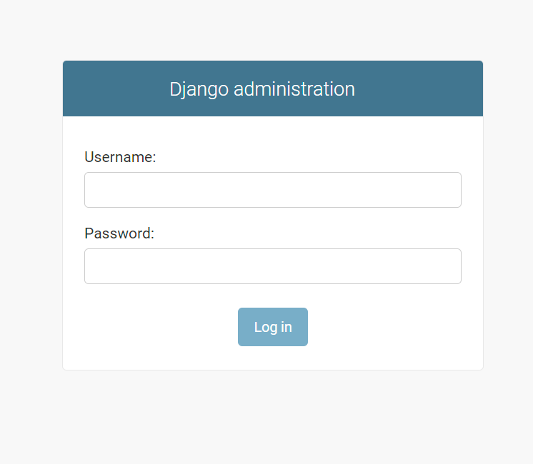
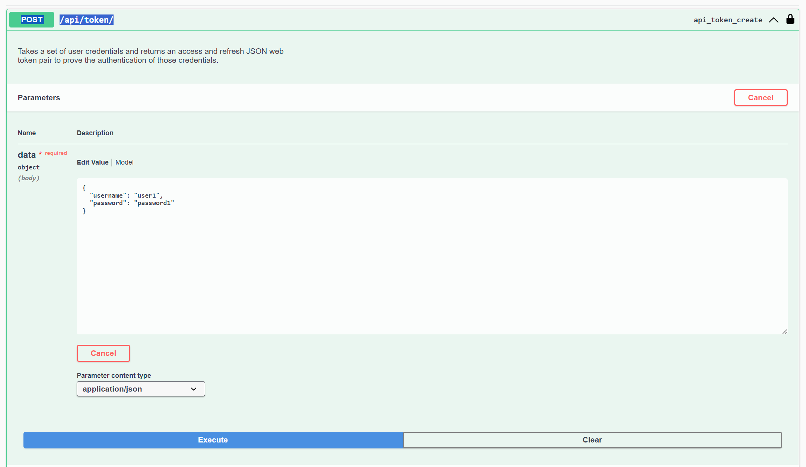
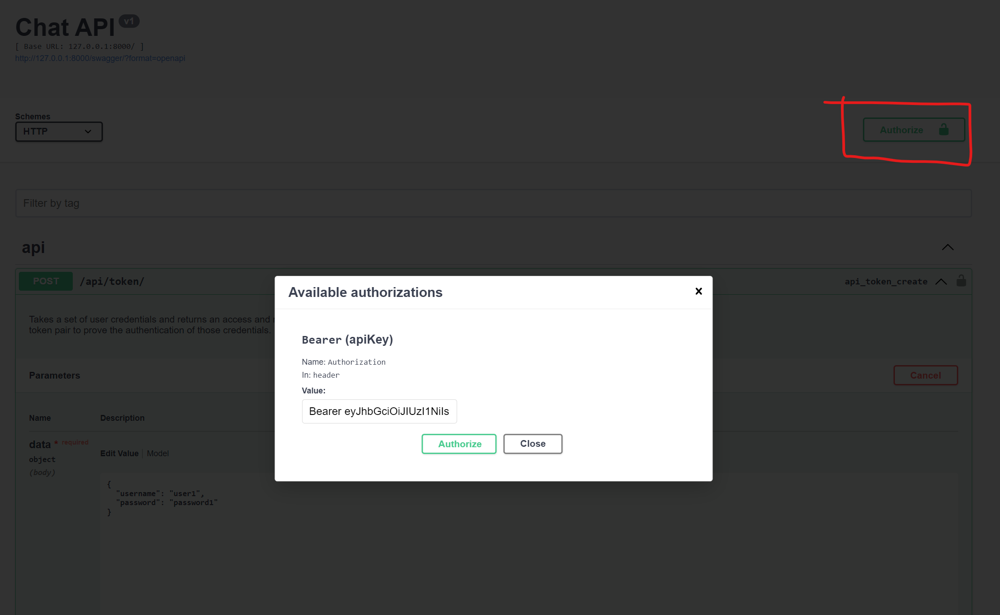
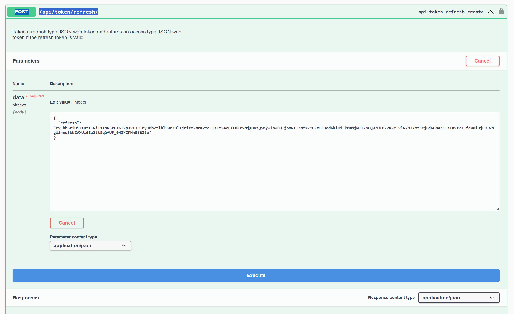

# Messaging App

Project Overview
This project implements a chat application where users can create and participate in threads, send messages, and mark messages as read. Below are details about the models, users, URL paths, permissions, and more.

---

## Setup

1. Install dependencies:
   ```bash
   pip install -r requirements.txt
   
2. Run migrations:
    ```bash
   python manage.py migrate
   
3. Load test data:
   ```bash
   python manage.py loaddata chat/fixtures/test_data.json
   
4. Start the server:
   ```bash
   python manage.py runserver
   
5. Use Swagger for API documentation http://127.0.0.1:8000/swagger/
   and Django admin for api administration http://localhost:8000/admin/

   ```
   In the admin authorization panel, enter:
   
   username root
   password index1501



## Description of work performed

### Models:

* Model `User` (basic Django User model)


* Model `Thread`:
  - **participants**: A many-to-many field that holds users participating in the thread. Only two participants can be in a thread.
    - Field Type: `ManyToManyField(User)`
    - Validation: No more than two participants.
  
  - **created**: Automatically set when the thread is created.
    - Field Type: `DateTimeField(auto_now_add=True)`

  - **updated**: Automatically set whenever the thread is updated.
    - Field Type: `DateTimeField(auto_now=True)`


* Model `Message`:
  - **thread**: The thread to which this message belongs.
      - Field Type: `ForeignKey(Thread)`
      - 
  - **sender**: The user who sends the message.
    - Field Type: `ForeignKey(User)`
  
  - **text**: The content of the message.
    - Field Type: `TextField`
  
  - **created**: Automatically set when the message is created.
    - Field Type: `DateTimeField(auto_now_add=True)`
  
  - **is_read**: Indicates if the message has been read.
    - Field Type: `BooleanField(default=False)`

---
## Users

Below are the created users and their respective credentials:

- **User1**: `username: user1`, `password: password1`
- **User2**: `username: user2`, `password: password2`
- **User3**: `username: user3`, `password: password3`
- **User4**: `username: user4`, `password: password4`
- **User5**: `username: user5`, `password: password5`
- **User6**: `username: user6`, `password: password6`

---

In order to log in, complete the request `POST /api/token/`:



click on the `Authorize` button and authorize using the received access token:



If the service access token expires, use the `POST /api/token/refresh/` and refresh token to get a new access token:



---

## URL Paths

### 1. `POST /chat/threads/`

- **Description**: Create a thread between two users. If a thread already exists between the two participants, it returns the existing thread.
- **Permissions**: Only authenticated users.
- **Logic**:
  - Checks if a thread with the same participants exists.
  - If yes, return the thread. Otherwise, create a new one.
  
### 2. `DELETE /chat/threads/delete/{thread_id}/`

- **Description**: Delete a thread if the user is a participant or an admin.
- **Permissions**: Only thread participants or admin.
- **Logic**:
  - Checks if the user is a thread participant or has admin rights.
  - Deletes the thread if permission is granted.

### 3. `GET /chat/threads/`

- **Description**: Retrieve the list of threads the user is participating in.
- **Permissions**: Only authenticated users.

### 4. `POST /chat/messages/create/`

- **Description**: Send a message in a thread.
- **Permissions**: Only thread participants.
- **Logic**:
  - Ensures the sender is a participant of the thread before sending the message.
  - Saves the message with the sender as the user making the request.

### 5. `GET /chat/messages/list/{thread_id}/`

- **Description**: Retrieve all messages from a thread.
- **Permissions**: Only thread participants or admin.
- **Logic**:
  - Checks if the user is a participant of the thread before returning messages.

### 6. `PUT /chat/messages/read/{id}/` or `PATCH /chat/messages/read/{id}/`

- **Description**: Mark a message as read.
- **Permissions**: Only participants who are not the sender of the message.
- **Logic**:
  - The recipient of the message can mark it as read.

### 7. `GET /chat/messages/unread-count/`

- **Description**: Retrieve the count of unread messages for the logged-in user.
- **Permissions**: Only the authenticated user can see their unread messages.

---

## Permissions Classes

### 1. `IsAdminOrThreadParticipant`

- **Purpose**: Allows only the thread participants or an admin to view or delete a thread.
  
### 2. `IsThreadParticipant`

- **Purpose**: Ensures that only participants of a thread can send or view messages in that thread.

---

